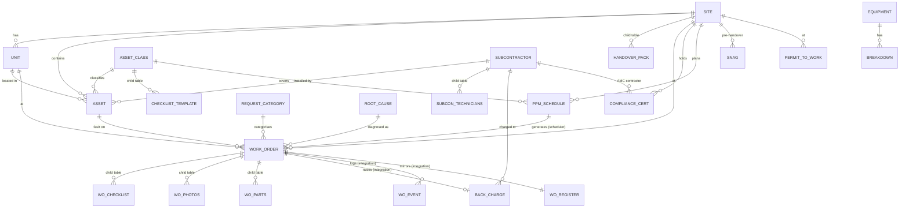

# DATA_MODEL.md: CAFM on Kissflow (Phase 3, for review)

> **Status: proposal, nothing built.** No Kissflow objects were created or changed. All live calls against `CAFM_POC_A00` were read-only GETs.
> Machine-readable version: [`data-model/app-spec.json`](data-model/app-spec.json), generated by [`data-model/build_ir.py`](data-model/build_ir.py).
> **Dry-run result** with the Kissflow App Agents engine v1.6.0:
> - `validate`: **0 errors, 0 warnings**
> - `verify`: **0 errors**, 1 expected warning (`NO_PAGES`; the Custom UI replaces native pages)
> - offline `build --no-pages`: **0 errors**. It compiles to 13 dataforms, 3 processes, 2 boards with their status flows, 16 lists, 10 roles and 120 permission grants, written to `data-model/kf-build-out/`.
>
> **Legend**
> - ✅ **verified**: confirmed by a live read-only call, the offline compile, or the plugin's live-verified references
> - 🟡 **exists but unproven**: in the platform metadata, but not yet exercised on this account
> - ❓ **needs a test**: to be tested in Phase 4 before relying on it

---

## 0. The recommendation on one page

| # | Entity | Kissflow type | Why this type |
|---|---|---|---|
| 1 | **Work Order** | **Process** | It has structured, role-owned routing, including a **conditional branch by liability** (subcontractor / FM / engineering review). It needs step-level field control: residents see only the request, only the technician can edit close-out fields, and the resident sees none of the liability data. It needs step SLAs with deadline triggers, and native send-back from Verify to the technician. My-tasks/my-items also give **row-level security for free**. |
| 2 | **Back-charge** | **Process** | Issue → subcontractor accepts or disputes → dispute review (conditional) → recovery confirmed. This is a structured approval with a decision point. |
| 3 | **Permit to Work** | **Process** | Requested → HSE approval → work active (controls confirmed) → HSE close-out. Approval plus close-out. |
| 4 | **Snag** | **Board (Case)** | Free-moving statuses (Open → In progress → Ready for inspection → Carried into DLP → Closed), with a Kanban view for the handover team. There is no fixed approval chain. |
| 5 | **Plant breakdown** | **Board (Case)** | Reported → Diagnosing → Awaiting parts → Under repair → Back in service. A tracking board. |
| 6 | Site, Unit, Subcontractor, Asset Class, Request Category, Root Cause, SLA Policy, **Asset** | **Dataform** (masters) | Records with no workflow. They feed Reference fields. They stay **editable after publish** (published processes are not; see §14). |
| 7 | Compliance Certificate, PPM Schedule, Equipment | **Dataform** (registers) | Records with expiry and state, no approval chain. RAG status and "days to expiry" are computed. |
| 8 | **WO Register** | **Dataform** (reporting table) | One row per work order. It is **seeded with 6 months of history** (process items can't be backdated) and **kept current by integrations** from the Work Order process. Dashboards read this, not process items, so executives don't need flow-admin rights. |
| 9 | **WO Event** | **Dataform** (activity log) | Written **only by integrations**, from Process triggers. Every role gets **View only**, so users can't edit or add entries: an append-only log by permission design. |
| 10 | Priority, Channel, Trade, Liability, … (16) | **List** | Option sets for Select fields. |

**Why not a Board for work orders?** The plugin's own rule sends "tickets" to Boards. Here, though, the liability branch, step-level field permissions, per-step SLAs and field-based assignment (§5.4) are all Process features. Boards also have native assignee, due date and overdue triggers, so they're a credible fallback if you prefer drag-and-drop over routed steps. I recommend Process.

---

## 1. What I checked before proposing this (no guessing)

**Live, read-only, against `development-r1100` / `CAFM_POC_A00`:**

| Check | Result |
|---|---|
| App | ✅ Exists: "CAFM - POC", Live, one "Home Page", roles **Admin** and **User** only, Custom UI **off** (`_is_custom_ui_enabled: false`). A clean slate. |
| Subscribed connectors (answers **Q13**) | ✅ Kissflow **Process** v3.7.6 (17 triggers / 7 actions), **Board** v2.1.0 (18/8), **Dataform** v1.5.4 (3/5), **Dataset** v2.0.14, **Scheduler** v1.0.7 (daily/weekly/monthly/yearly), **Email**, **Kissflow Notification** (in-app), **Webhooks**, **HTTP**, plus **Twilio** (SMS + WhatsApp send) and **IDP**, Intelligent Document Processing ("Autofill a dataform/process form" from documents) |
| Process triggers used here | ✅ "When an item is created", "…enters this step", "…advances to next step", "…crosses its deadline at this step", "…is sent back", "…completes its workflow" |
| Actions used here | ✅ Process "Create and submit a new item" and "Update an item"; Dataform "Create and submit an item", "Update an item" and "Fetch one or more items"; Board "Create an item"; "Send in-app notification"; "Send an email" |

**Kissflow App Agents plugin v1.6.0 (source of truth for what we can build):**
- The field types, reference/lookup shapes, aggregates, step conditions and parallel branches used here are all in the engine's supported set, and all compiled offline.
- **Custom UI SDK** (from the `@kissflow/create-app` scaffold docs):
  - Process: `getMyItems`, `getMyTasksItems`, `getParticipatedItems`, `getAdminItems` (admin only), `getProgress` (native per-item timeline), `createItem`, `updateItem`, `submitItem`, `sendbackItem`, `reassignItem`
  - Dataform and Board: `getItems` with paging and filter payload
  - `kf.api(url)` for raw REST
  - `kf.user.AppRoles` (answers **Q6/Q11**)

**Engine gaps I found by compiling, not assuming.** Each is designed around below.
1. The last step of a process compiles as an **automatic end event with no assignee**. Each process therefore ends with an explicit named end step ("Closed", "Recovered", "Permit closed").
2. **Child tables nested inside a form are silently dropped** by the builder, while validation still says 0 errors. The model uses the builder's supported shape: sibling forms plus `childTables` links. I confirmed WO Checklist, WO Photos and WO Parts compile into the Work Order.
3. **Formulas can't read a looked-up value by dotted path.** For example, `Asset.DLP_End_Date` silently degrades to "no formula". The model uses **autofill copies** (the reference copies the looked-up values into same-named local fields), and formulas read those. All 9 Work Order formulas now compile.
4. **Comparing numbers inside a Text formula** compiles as a string comparison ("10" < "6"). Numeric tests go into Number helper fields first (`Summer Flag`, `DLP Covered`).
5. The engine can only **assign steps to roles**. Assigning to "the user in field X" exists in the platform (`ResourceValueType: Field`) but has to be set in the builder UI after the API build (§14).
6. The engine does **not author SLAs** (answers **Q12**: builder-only). Step SLAs, including a different duration per priority, are set in the builder (§14).
7. The `Signature` field type isn't in the engine's metadata catalog, so the occupant signature is stored as an **Image** (PNG), which is what the UI captures anyway.

---

## 2. Relationship map

Links from a Dataform to a **Process** item (Back-charge, WO Event and WO Register → Work Order) are stored as **Work Order No + instance id text fields**, not Reference fields. Reference fields target Dataforms/Datasets. Whether a Reference can target a Process is ❓, so this avoids depending on it.

---

## 3. Masters (Dataforms)

| Form | Key fields (type) | Notes |
|---|---|---|
| **CAFM Site** | Site Code, Site Name, Site Name AR, District, Site Kind (Select), Client Name, **Own Operations** (Boolean), **TOC Date**, **DLP Months**, **DLP End Date**, **Decennial End Date**, Floors, Unit Count, Beds · child table **Handover Pack** (Pack Item, Received, Received On, Item Count, Pack Document) | Holds the handover clock. DLP End is a stored Date, because date-returning formulas aren't supported by the engine (§14). |
| **CAFM Unit** | Unit Number, Site (Ref), Floor, **Resident** (User) | About 490 rows (Qamar 312, Jaddaf Point 180). |
| **CAFM Subcontractor** | Company Name (+AR), Trade, **Supervisor** (User), Contact Email, Trade Licence No/Expiry, Insurance Expiry, Civil Defence Approved + Expiry, **Licence Days Left** = `DATEDIFF(TODAY(), Trade_Licence_Expiry, "Day")` · child table **Subcontractor Technicians** (Technician User, Skill) | The Supervisor field drives field-based assignment (§5.4). |
| **CAFM Asset Class** | Class Code, Class Name (+AR), Trade, Warranty Months, PPM Frequency · child table **Checklist Template** (Check Step, +AR, Needs Reading) | The template seeds the WO checklist. |
| **CAFM Request Category** | Code, Name (+AR), Trade, **Base Priority** (P1–P4), **Summer Uplift** (Boolean), **Structural** (Boolean) | Summer-rule and decennial routing are configuration, not code. |
| **CAFM Root Cause** | Code, Name (+AR), Trade, **Excluded From DLP** (Boolean) | Drives reclassification to chargeable. |
| **CAFM SLA Policy** | Priority, Response Minutes, Resolve Minutes, At Risk Percent | The "approval matrix" dataform pattern (native Decision Tables are plan-gated, per plugin LESSONS §14). This is the documented source of truth. The process SLA and formulas mirror it. |
| **CAFM Asset** | Asset Tag, QR Code, Site/Unit (Ref), Floor, Location (+AR), Asset Class (Ref), Make, Model, Serial, **Installed By** (Ref Subcontractor), **Batch**, Handover Date, **DLP End Date**, Warranty End, Decennial End, Asset Status, Asset Photo (Image) | About 670 rows. Batch enables batch-defect detection. |

---

## 4. Work Order: the core process

### 4.1 Fields by section (49 fields plus 3 child tables)

| Section | Fields | Who can edit |
|---|---|---|
| **Request** | Site (Ref, autofill), Unit (Ref), Category (Ref, autofill), Request Title, Description, Description Language, **Channel**, Reporter Name, **First Contact At** (DateTime; the SLA clock starts here, not at data entry), **Conversation Transcript** (Textarea; voice-agent calls only), **Vulnerable Occupant** (Boolean), **Access Window** (Text) | Initiator (resident / helpdesk / QR public form); Helpdesk at Triage |
| **Liability data** (autofill copies) | Own Operations, Base Priority, Summer Uplift, Structural, Asset Tag, DLP End Date, Warranty End Date, Decennial End Date, Batch, Excluded From DLP | Nobody. **Hidden** from the resident, read-only everywhere else. Autofill writes them. |
| **Triage** | Asset (Ref, autofill), Installed By (Ref), **computed** Report Month, Summer Flag, **Priority**, **Response Minutes**, **Resolve Minutes**, DLP Days Left, DLP Covered, **Liability**, AI Suggested Category, AI Confidence | Helpdesk (computed fields are read-only) |
| **Dispatch** | Assigned Technician (User), Accepted At | Dispatching supervisor |
| **Execution** | Root Cause (Ref, autofill), Arrived At, On Hold Reason, Supply Air Reading, Diagnosis Challenge Shown, Challenge Acknowledged, Closeout Note, Labour AED, **Parts AED** (sum of WO Parts), Occupant Signature (Image), Resolved At | Technician only, at "Work in progress" |
| **Verification** | Verified At, Back-charge Ref | Helpdesk at "Verify and close" |
| **Child tables** | **WO Checklist** (Check Step, Done, Reading) · **WO Photos** (Photo Image, Photo Kind, Caption) · **WO Parts** (Part, Qty, Unit Cost, **Line Total** = `Qty * Unit_Cost`) | Checklist, Photos and Parts are editable by the technician. The resident can add photos at the start step. |

### 4.2 The liability engine as Kissflow formulas (✅ all compile offline; ❓ runtime date semantics, see §15)

| Field | Formula |
|---|---|
| Report Month (Number) | `MONTH(First_Contact_At)` |
| Summer Flag (Number) | `IF(AND(Summer_Uplift, Report_Month >= 6, Report_Month <= 9), 1, 0)` |
| **Priority** (Text) | `IF(AND(Summer_Flag = 1, Base_Priority = "P3"), "P2", Base_Priority)` |
| Response Minutes | `IF(Priority = "P1", 30, IF(Priority = "P2", 60, IF(Priority = "P3", 240, 1440)))` |
| Resolve Minutes | `IF(Priority = "P1", 240, IF(Priority = "P2", 480, IF(Priority = "P3", 4320, 14400)))` |
| DLP Days Left | `DATEDIFF(First_Contact_At, DLP_End_Date, "Day")` |
| DLP Covered (Number) | `IF(DLP_Days_Left >= 0, 1, 0)` |
| **Liability** (Text) | `IF(Own_Operations, "OWN_OPS", IF(Structural, "DECENNIAL_REVIEW", IF(Excluded_From_DLP, "CHARGEABLE", IF(DLP_Covered = 1, "DLP", "CHARGEABLE"))))` |

These mirror the frontend's tested TypeScript engine (`app/src/domain/liability.ts`, `sla.ts`), so the UI and Kissflow agree. Because Liability re-evaluates when the technician records the Root Cause, **reclassification to chargeable happens in Kissflow itself**.

Differences from the frontend engine:
- **Warranty** (outside DLP but inside the manufacturer warranty) isn't in the Kissflow formula yet. I kept it out to limit formula depth.
- The due timestamps (`First Contact + minutes`) are computed in the Custom UI and by the native step SLA, not by a formula (§14).

### 4.3 Workflow (✅ compiles; conditions compiled as step formulas)

| # | Step | Assignee | Condition (runs only if) | What happens |
|---|---|---|---|---|
| 1 | Request raised *(start)* | Initiator: Resident, or Helpdesk / FM Manager on the resident's behalf | – | Request section only |
| 2 | Triage | Helpdesk | – | Confirm category and asset. Priority and liability compute. |
| 3a | Subcontractor dispatch | Subcontractor Supervisor → **field-based: `Installed By.Supervisor`** (§5.4) | `OR(Liability = "DLP", Liability = "WARRANTY")` | Accept and assign a technician (response SLA) |
| 3b | FM dispatch | FM Manager | `OR(Liability = "CHARGEABLE", Liability = "OWN_OPS")` | Same, for the FM operator's team |
| 3c | Engineering review | DLP Manager | `Liability = "DECENNIAL_REVIEW"` | Structural defects go to engineering |
| 4 | Work in progress | Technician → **field-based: `Assigned Technician`** | – | Checklist, photos, root cause, parts, signature (resolution SLA) |
| 5 | Verify and close | Helpdesk | – | Verify with the resident, or send back to step 4 (native) |
| 6 | Closed *(end)* | – | – | Triggers the back-charge integration if Liability = DLP |

"On hold" (awaiting parts) is a field on step 4, not a separate step: the plugin's workflow guidance says to cut steps only when the actor, decision or wait changes. Reject and send-back are native on every step.

### 4.4 SLA (🟡 set in the builder, since the engine can't author it)
- **Step 3a/3b/3c SLA = response.** P1 30 min, P2 1 h, P3 4 h, P4 1 day. SLA supports Criteria, so there's one duration per priority. **Escalate before the deadline** to the FM Manager.
- **Step 4 SLA = resolution.** P1 4 h, P2 8 h, P3 3 days, P4 10 days. Escalate to the DLP Manager when Liability = DLP.
- The deadline triggers ("crosses its deadline at this step") feed the WO Event log and the Register.

---

## 5. The other processes and the boards

### 5.1 CAFM Back-charge (Process)
- **Fields:** Work Order No, Work Order Instance, Subcontractor (Ref), Site, Root Cause, Parts AED, Labour AED, **Total AED** = `Parts_AED + Labour_AED`, Subcontractor Response (Accept/Dispute), Dispute Reason, Agreed AED, Recovered On.
- **Steps:**
  1. Back-charge raised (start). Created by integration; the DLP Manager is the initiator of record.
  2. Subcontractor response (field-based: the subcontractor's Supervisor).
  3. Dispute review (DLP Manager, only if `Subcontractor_Response = "Dispute"`).
  4. Recovery confirmation (DLP Manager).
  5. Recovered (end).

### 5.2 CAFM Permit To Work (Process)
- **Fields:** Permit Type, Site, Work Order No, Work Location, Valid From/To, Gas Test Reading, Isolation Points, Approval Note, Closed Out At · child table **Permit Controls** (Control, Confirmed).
- **Steps:** Permit requested (Technician) → HSE approval (HSE Officer) → Work active (Technician confirms controls) → HSE close-out → Permit closed.

### 5.3 Boards (Case flows, ✅ compile with their status flows)
- **CAFM Snag:** Site, Unit, Trade, Subcontractor, Snag Location, Snag Photo, plus the board's native Summary, Description and Attachment. Statuses: Open → In progress → Ready for inspection → **Carried into DLP** → Closed (free movement, plus the system "Reopened").
- **CAFM Breakdown:** Equipment (Ref), Reported At, Downtime Hours, Repair Cost AED. Statuses: Reported → Diagnosing → Awaiting parts → Under repair → Back in service.

### 5.4 Field-based assignment (🟡 set in the builder after the API build)
The platform supports assigning a step to **the user held in a field** (`ResourceValueType: Field`), which is what gives each subcontractor privacy:
- WO step 3a goes to the `Installed By → Supervisor` user (autofilled).
- WO step 4 goes to `Assigned Technician`.
- Back-charge step 2 goes to `Subcontractor → Supervisor`.

A subcontractor supervisor then only ever sees their own firm's jobs through *My tasks*. The engine builds these steps role-assigned, and I switch them to field-based in the builder (you or I, with builder access) before go-live. For the demo there's only one subcontractor supervisor, so role assignment behaves identically.

---

## 6. Registers (Dataforms)

| Form | Fields | Computed |
|---|---|---|
| **CAFM Compliance Certificate** | Site, Compliance System (Select), Contractor (Ref), Certificate No, Issued On, **Expires On**, Last Inspection, Open Findings, Hassantuk Status (status only, no integration), Evidence (Attachment) | **Days To Expiry** = `DATEDIFF(TODAY(), Expires_On, "Day")`. RAG = red if <0 or ≥2 findings; amber if <30 days or 1 finding. RAG is computed in the Custom UI from these fields. |
| **CAFM PPM Schedule** | Schedule Title (+AR), Site, Asset Class, Frequency, Asset Count, Contractor, Next Due Date, Active | – |
| **CAFM Equipment** | Fleet No, Equipment Type, Make, Model, Year, Current Project, Hour Meter, Next Service Hours, **TPI Expiry**, Equipment Status | **Hours To Service** = `Next_Service_Hours - Hour_Meter` |
| **CAFM WO Register** | WO No + instance, Site, Unit Number, Asset Tag, Batch, Category Name, Channel, Priority, Summer Uplift, **Liability**, Current Step, First Contact At, Response/Resolve Due At, Responded/Resolved/Closed At, Subcontractor, Technician, Root Cause Name, Parts, Labour, **Total Cost AED** (formula), Back-charge Ref/Status, Recovered On | Every KPI on the command centre, the monthly report, the subcontractor scorecards and batch detection is computed from this table in the Custom UI. |
| **CAFM WO Event** | Work Order No + instance, **Event Type** (Select, 14 types), Event At, Actor (User), Actor Label, Event Detail | Append-only by permission design: integrations write, everyone else views. |

---

## 7. Lists (16, all prefixed `CAFM` to avoid account-wide name collisions, per plugin LESSONS §5)
- Priority (P1–P4)
- Channel (9, incl. "Voice agent")
- Trade (7)
- Site Kind
- Asset Status
- Liability (6)
- Photo Kind
- Compliance System (10)
- Hassantuk Status
- PPM Frequency
- Permit Type
- Equipment Type (10)
- Equipment Status
- Subcontractor Response
- Event Type (14)
- Language

---

## 8. Roles and data scope

The 10 app roles map 1:1 to the demo personas. Admin and User already exist and are left alone.

| Role | Work Order | Back-charge | PTW | Snag | Registers & masters | WO Register / Event |
|---|---|---|---|---|---|---|
| Executive | View all | View all | – | View | View | View all |
| FM Manager | Act (FM dispatch), view all | – | View | – | **Edit masters**, edit PPM | View all |
| Helpdesk | Initiate, triage, verify, view all | – | – | – | View | View all |
| DLP Manager | Engineering review, view all | **Owns** | – | **Owns** | **Edit masters** | View all |
| Subcontractor Supervisor | **Own firm's tasks only** | Respond (own) | – | Own firm's | View | Own firm's rows |
| Technician | **Assigned jobs only** | – | Request / close-out | – | View | View |
| Resident | **Initiate + own requests only** | – | – | – | View (for pickers) | – |
| Compliance Officer | – | – | – | – | **Edit compliance** | View all |
| HSE Officer | – | – | **Approve / close** | – | View | View |
| Plant Manager | – | – | – | – | **Edit equipment**; owns Breakdown board | – |

Caveat from the plugin (LESSONS §18): any role with Editable on a process also gets "initiate items". So Helpdesk, FM Manager and the other actors could technically raise work orders too. For a CAFM that's desirable (helpdesk logs calls). It's listed so it's a conscious choice.

**Residents at scale** would be Portal users or come through a public form, not app licences (**Q15/Q19**). For the demo, Resident is an app role.

---

## 9. Automations (integrations: trigger → action, connectors ✅ subscribed)

> **As built (22 Sep):** see BACKEND_CATALOG.md "Integrations". Seven single-step integrations are live but switched off. The Register gets a row on close rather than live updates. A6/A7 (schedulers) are builder steps.

| # | Trigger (connector) | Action (connector) | Purpose |
|---|---|---|---|
| A1 | WO **item created** (Process) | Create Register row (Dataform) + Create Event "Created" (Dataform) | Mirror and log from the first second |
| A2 | WO **enters step** Subcontractor/FM dispatch, Work in progress, Verify (Process) | Update Register "Current Step" and timestamps (Dataform) + Event | Live SLA board and activity log |
| A3 | WO **crosses its deadline at this step** (Process) | Event "SLA breach" + **Send in-app notification** + Email the FM Manager | Escalation trail |
| A4 | WO **completes its workflow** (Process), if Liability = DLP | **Create and submit Back-charge** (Process) + update Register | The DLP back-charge "raises itself" |
| A5 | Back-charge **completes** (Process) | Update the Register's back-charge status and Recovered On | Recovery shows on the dashboard |
| A6 | **Scheduler** monthly | Create PPM work orders (Process "Create and submit items in bulk") from active PPM Schedules | Planned maintenance feeds the same queue |
| A7 | **Scheduler** daily | Fetch Compliance Certificates expiring within 30 days → in-app notification to the Compliance Officer | Renewal alerts |
| A8 *(optional)* | Twilio **Send a WhatsApp message** | – | Tell the resident their job is on the way or done (**needs a Twilio account**) |
| A9 *(optional)* | Webhooks **inbound** | Create WO (Process) | Integration path for WhatsApp inbound, BMS alarms or a call-centre |
| A10 *(optional, real AI)* | Attachment added to Compliance Certificate | **IDP "Autofill a dataform"** | Read certificate number, expiry and contractor off the uploaded PDF |

Plugin facts that apply (INTEGRATION-CATALOG):
- The API can create and publish integrations, but **turning one on needs the builder UI or admin rights**. You'd flip them on after Phase 4, or I do it with builder access.
- Conditional actions (A4's "if Liability = DLP") use integration IfActions, which are 🟡 (documented, not yet exercised).
- A6's loop over schedules is ❓. The fallback is a "Generate this month's PPM" button in the Custom UI that creates the WOs through the SDK.

---

## 10. Where each business rule lives

| Rule | Kissflow | Custom UI | Why |
|---|---|---|---|
| Liability (DLP / chargeable / decennial / own ops) | ✅ formula on WO | mirrors for instant preview on the intake screen | Kissflow is the authority; the UI previews before submit |
| Summer uplift + priority | ✅ formula | mirror | same |
| Routing by liability | ✅ step conditions | – | |
| Reclassification on excluded root cause | ✅ formula re-evaluates | shows the "reclassified" result | |
| Response/resolution deadlines + escalation | 🟡 step SLA (builder) | live staff-gauge countdown from First Contact + minutes | the SLA engine enforces; the UI visualises |
| Back-charge creation | ✅ integration A4 | – | |
| **Diagnosis challenge** (repeat faults + batch siblings) | data only (Register + Asset history) | ✅ logic in the UI | a cross-record query, not a field formula |
| Batch-defect detection | data only (Register) | ✅ logic in the UI | same |
| Compliance RAG | Days To Expiry formula | RAG thresholds | |
| AI preview features | – (store AI Suggested Category / Confidence) | mocked in the UI | runtime AI unverified; **IDP (A10) is the one real AI option** |

---

## 11. How the Custom UI reads and writes it (Phase 6 adapter)

| Frontend service (`app/src/services/types.ts`) | Kissflow call |
|---|---|
| `workOrders.create` | `kf.app.getProcess("CAFM_Work_Order_A00").createItem` + `submitItem` |
| `workOrders.accept / arrive / resolve / verifyAndClose` | `updateItem` + `submitItem` on the current `activityInstanceId` |
| `workOrders.list` (queues) | `getMyTasksItems` (technician, supervisor), `getMyItems` (resident), Register `getItems` with filter (helpdesk, FM, exec) |
| `workOrders.get` → activity log | `getItem` + **`getProgress`** (native timeline) + WO Event `getItems` (filter by WO No) |
| `assets.*`, `directory.*` | Dataform `getItems` / `getItem` |
| `assets.diagnosis` | Register `getItems` filtered by Asset Tag / Batch |
| `dlp.*` | Back-charge process (my tasks / admin) + Register |
| `handover.snags / moveSnag` | Board `getItems`; status move |
| `reports.commandCentre / monthly` | computed from Register `getItems` (paged) |
| roles | `kf.user.AppRoles` replaces the demo role switcher |

---

## 12. Seed data (Phase 4, idempotent, masters first)

Data comes from the same deterministic generator the demo uses, so screens look identical.

| Data | Rows | How |
|---|---|---|
| Lists | 16 | list items |
| Sites (with handover pack) | 5 | Dataform create |
| Subcontractors | 7 | Dataform create |
| Asset classes, categories, root causes, SLA policies | ~50 | Dataform create |
| Units | ~490 | Dataform create |
| Assets | ~670 | Dataform create |
| **WO Register history** | ~1,050 | Dataform import (6 months, with the Aug AC spike and the B07 batch pattern) |
| Compliance certificates | 26 | Dataform create |
| PPM schedules | 17 | Dataform create |
| Equipment | 60 | Dataform create |
| Snags | 186 | Board items, then status moves |
| **Live work orders** | ~11 open | Real process items, walked to their current step so queues and tasks work |
| **Storyline WO** (Apt 1402) | 1 | Raised live in the demo |

The live work orders are the only process data. History lives in the Register because process timestamps can't be backdated.

---

## 13. Phase 4 build order (after your approval)

1. **Roles** (10).
2. **Lists** (16).
3. **Masters** in reference order: Site → Subcontractor → Unit → Asset Class → Category → Root Cause → SLA Policy → Asset.
4. **Formula sandbox:** because a **published process can't be changed over the API** (plugin LESSONS §1b), I first prove the date formulas (`MONTH`, `DATEDIFF` argument order and units, autofill copies) on a **temporary dataform**, which *is* editable. Only then is the Work Order process published.
5. **Processes:** Work Order → Back-charge → PTW, with a dry run (`author-preview`) shown to you before each publish.
6. **Boards:** Snag, Breakdown (including the case-member grant the plugin flags as the "step everyone misses").
7. **Registers:** Compliance, PPM, Equipment, WO Register, WO Event.
8. **Permissions** (120 grants) and a re-grant pass for 423 locks.
9. **Integrations** A1–A7, created and published. You or I turn them on in the builder.
10. **Builder-only settings:** step SLAs per priority, field-based assignees, public form (if wanted).
11. **Seed** (§12). Verify counts. Report.

Your conventions apply throughout: `kf.account._id` read dynamically, `kf.api()` not `fetch`, explicit null guards, and `not(…)` in the formula builder.

---

## 14. What the engine can't build (manual builder steps)

| Item | Why manual | Effort |
|---|---|---|
| Step SLAs per priority + escalation | The engine carries SLAs in its spec but doesn't emit them | ~15 min in the builder |
| Field-based assignees (3 steps) | Engine only emits role assignees | ~5 min |
| Turning integrations on | 403 with an API key (admin/builder only) | 1 click each |
| Public form on Work Order (QR poster) | Engine doesn't author it; the setting exists (`PublicFormSettings`) | ~5 min, if wanted |
| Date-returning formulas (e.g. DLP End = TOC + 12 months) | The engine types formula outputs as Number or Text only | Stored as dates (seeded) |
| Custom UI upload | Phase 6, you lead | – |

---

## 15. Risks and decisions I need from you

**Decisions**
1. **Work Order as Process** (recommended), or as Board?
2. **WO Register + integrations for dashboards and history** (recommended), or give dashboard roles flow-admin and read process items directly (no history before go-live)?
3. **Field-based assignment** set in the builder after the API build: are you OK with that manual step?
4. **Optional extras for the POC:** A8 WhatsApp via Twilio (needs a Twilio account), A10 IDP certificate autofill (real AI, needs a test), public form for QR requests.
5. **Warranty liability** in the Kissflow formula now, or later?

**Risks and unknowns to test first in Phase 4 (all on editable dataforms, before any process publish)**
- ❓ `DATEDIFF` argument order and units string in the runtime.
- ❓ Whether autofill writes into read-only fields.
- ❓ Whether `TODAY()` in dataform formulas refreshes daily.
- 🟡 SLA Criteria per priority.
- 🟡 Integration IfActions.
- ❓ Scheduler loop for PPM.
- ⚠️ A process published with a mistake has to be rebuilt as a new flow. That's why step 4 of §13 is there and why each publish waits for your go-ahead.
- ⚠️ The Custom UI reads process field values fully only inside the Kissflow runtime; the integration key sees a sparse projection (plugin runtime note). That's fine for Custom UI, but the Register also covers external reporting.

---

## 16. Phase 4 build: what changed after testing on the live runtime (22 Sep)

Built into the existing app **CAFM_POC_A00**: 10 roles, 16 lists, 14 dataforms, 3 processes (Work Order, Back-charge, Permit To Work), 2 boards (Snag, Breakdown), all 8 child tables, 120 role grants (audited: 120/120). There are no native pages or nav (custom-UI mode). Build scripts are in `data-model/` (`apply-stage.mjs`, `regrant.mjs`, `audit-grants.mjs`, `sandbox-test.mjs`, `wo-acceptance.mjs`).

Before any process was published, the formulas were run at runtime on an editable sandbox dataform (the plan's §13 step 4). The runtime findings changed the model:

| Found at runtime | Change in the model |
|---|---|
| `>=`, `<=`, `>`, `NOT`, `ISBLANK` and 4-argument `OR` return empty. `DATEDIFF` with a DateTime is empty, and with two Dates it returns *absolute* days | Date checks use a sortable key (`YEAR*372 + MONTH*31 + DAY`); "covered" is `IF(ABS(gap) = gap, 1, 0)`. Summer months are an `=` chain. Expiry countdowns are signed via the same key. |
| The engine types every node in a formula as the formula's output type, so a Text formula can't read a number | Decisions are **Number codes**: `Priority Code` 1–4 (P1–P4), `Liability Code` (1 DLP, 2 Chargeable, 3 Decennial review, 4 Warranty, 5 Own ops) and `Dispatch Code` (1 subcontractor, 2 FM, 3 engineering). Step conditions are `Dispatch_Code = 1/2/3`. The Custom UI maps codes to labels. |
| Formula chains deeper than 3 read stale values (about 3 evaluation passes) | Chains flattened: Priority, DLP Covered and Warranty Covered read input fields directly. The deepest is Dispatch Code, at depth 3. |
| Currency values are text ("3.5 AED"), and every Currency formula is empty | All money fields are **Number (AED)**: Unit Cost AED, Line Total AED, Parts/Labour/Total AED, Agreed AED, Repair Cost AED. |
| Lookup autofill does **not** run on an API create (the values arrive inside the reference only) | The Custom UI adapter (Phase 6) writes the copy fields itself: Own Operations, Base Priority, Summer Uplift, Structural, Asset Tag, DLP/Warranty End Date, Batch. An update recomputes all formulas (verified). |
| Date functions evaluate in UTC | Accepted. A call between 00:00 and 04:00 GST counts as the previous day, which only matters on the DLP end date itself. |
| "DLP Days Left" can't be computed on the process (DateTime) | Removed from the WO. The Custom UI computes days left, as it does today. |

**Proven:** 10/10 sandbox cases (summer AC inside DLP, warranty, chargeable, blank dates, own ops, structural, winter, DLP end day, the day after, excluded root cause). Plus one live **[TEST]** Work Order: it computed P2 / 60 min / DLP / subcontractor, went Triage → **Subcontractor dispatch**, and was assigned to *Subcontractor Supervisor*.

**Decisions Q29–Q33 (Thomas: "go with the recommendations"):** WO as Process · WO Register for dashboards/history · field-based assignees and step SLAs set in the builder (manual) · Warranty in the liability formula now · Q32: public QR form **yes** (builder toggle), Twilio WhatsApp **not now** (no Twilio account), IDP certificate autofill **not now** (unverified AI, not needed for the storyline).

**Still to build (Phase 4 continues):** integrations A1–A7 (switched on in the builder), builder-only settings (§14), full seed (§12).
